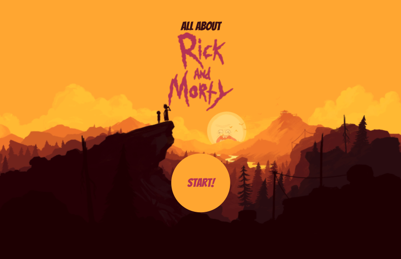
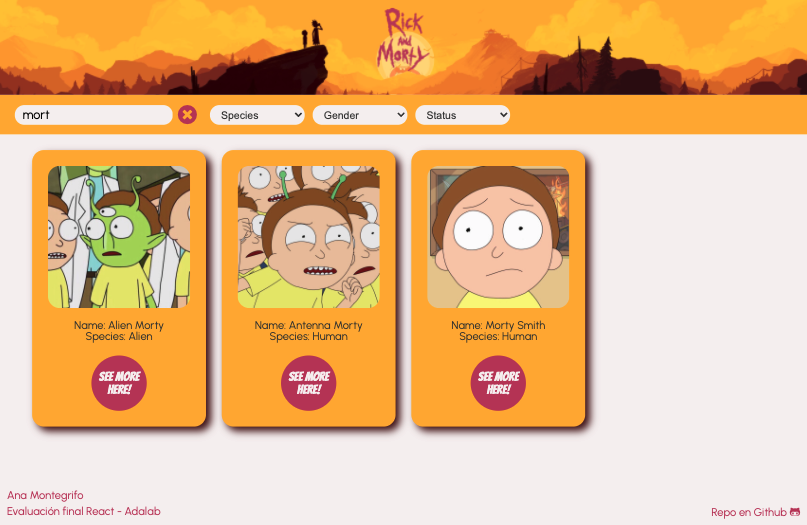
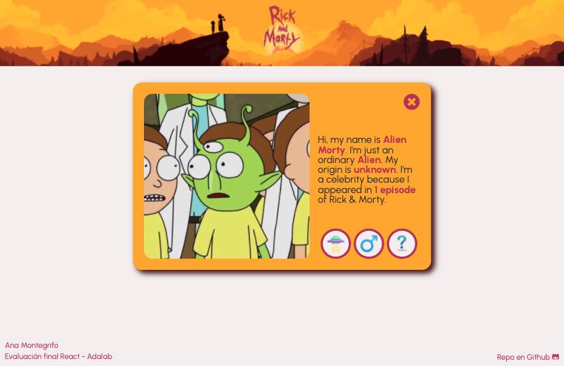

# Evaluación final React

Este es el trabajo de evaluación final de React en Adalab. Consiste en crear una web de personajes de Rick & Morty, utilizando la [Rick and Morty API](https://rickandmortyapi.com/).

El proyecto está creado sobre el React Starter Kit de Adalab, y se trata de una web que nos permite consultar los personajes de la serie, realizar búsquedas por nombre, filtrar por distintos criterios y ver la información detallada de cada uno.

Esta es la apariencia de la web:

Home:



Busqueda en el listado de personajes:



Detalle del personaje:



### Estructura del proyecto

Esta es la estructura de carpetas:

```
src
 ├── components
 |  ├── App.js
 |  └── SecondaryComponents.js
 |
 ├── images
 |
 ├── services
 |
 ├── styles
 |
 ├── index.js


```

### Tecnologías y recursos utilizados para el proyecto:

- HTML y preprocesador SASS con sintaxis SCSS
- Node.js
- Markdown
- Gulp
- Javascript
- React
